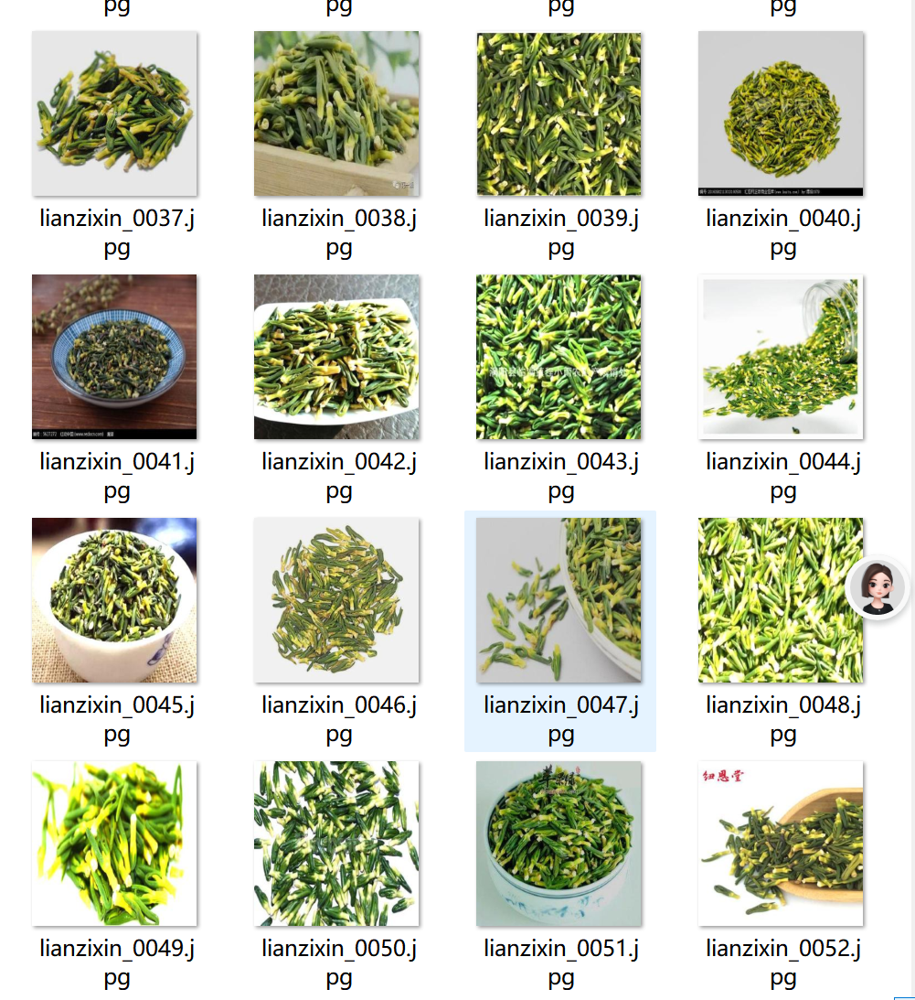

# 163 Traditional Chinese Medicine Classification Data Set

The dataset includes 163 types of traditional Chinese medicinal herbs and their detailed information, including folder name, image count, and the image count in subfolders. The dataset provides a detailed introduction to each traditional Chinese herb, including the number of images, the number in subfolders, and the specifics of the subfolders, such as "Sanqi" with 1638 images, "Danshen" with 1620 images, etc. Additionally, it also includes some common traditional Chinese herbs, such as ginseng, licorice, and Angelica sinensis, as well as some rare traditional Chinese herbs, such as Aconitum kusnezoffii and Prunus mume.
## Images

Here is a pay link on Stripe ( https://buy.stripe.com/3cs8yP7sY87d0vu9AB ). Please contact me lonlonago@foxmail.com after funding $89, and I will send you a complete data files , thank you!

